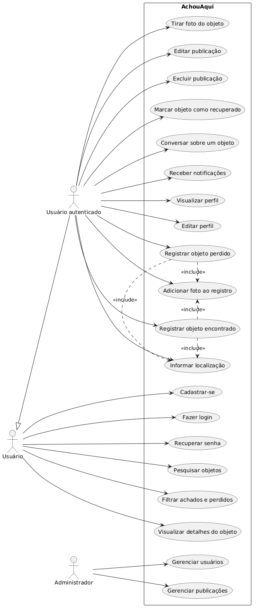

# AchouAqui

Aplicativo mobile de achados e perdidos desenvolvido como projeto acadêmico de Engenharia de Software.

O AchouAqui tem como objetivo permitir que usuários publiquem, pesquisem e acompanhem objetos perdidos ou encontrados, facilitando a comunicação entre as pessoas envolvidas.

## Status

🚧 Em desenvolvimento.

O projeto está sendo desenvolvido de forma incremental, com novas telas, funcionalidades, backend e integração com recursos do dispositivo sendo adicionados ao longo das etapas da disciplina.

## Funcionalidades

### Já desenvolvidas na interface

- Cadastro de usuário
- Login
- Tela inicial
- Perfil do usuário
- Criação de publicação
- Registro de objeto perdido ou encontrado
- Tela de detalhes da publicação
- Compartilhamento de publicação
- Campos para descrição, localização e demais informações do objeto
- Interface para visualizar publicações do aplicativo

### Planejadas

- Recuperação de senha
- Pesquisa de objetos
- Filtros por categoria, tipo, localização e data
- Adição de fotos
- Captura de fotos pela câmera
- Seleção de arquivos/imagens do armazenamento do dispositivo
- Localização por GPS
- Demonstração de interesse em uma publicação
- Contato entre usuários
- Chat
- Notificações
- Favoritos
- Histórico de interações e publicações
- Edição de publicações
- Exclusão de publicações
- Marcação de objeto como recuperado
- Minhas publicações
- Denúncias de publicações
- Edição de perfil
- Exclusão da conta

## Tecnologias

- React Native
- TypeScript
- Expo
- React Navigation
- Expo Vector Icons
- PostgreSQL
- Figma (prototipação)

## Identidade visual

A interface utiliza principalmente uma paleta baseada em roxo, laranja, branco e tons de cinza.

## Estrutura atual

```text
AchouAqui/
├── assets/
├── docs/
├── src/
│   └── screens/
│       ├── CreatePost.tsx
│       ├── EditProfile.tsx
│       ├── Home.tsx
│       ├── ItemDetails.tsx
│       ├── Login.tsx
│       ├── Profile.tsx
│       └── Register.tsx
├── App.tsx
├── index.ts
├── app.json
├── package.json
└── README.md
```

A estrutura poderá ser ampliada conforme o projeto receber backend, serviços, componentes reutilizáveis e novas telas.

## Executando o projeto

### Pré-requisitos

- Node.js
- npm
- Android Studio, para execução em emulador Android
- Expo

### Instalação

Clone o repositório e instale as dependências:

```bash
git clone https://github.com/WeverttonSouza1/AchouAqui.git
cd AchouAqui
npm install
```

### Executar

Inicie o projeto com:

```bash
npx expo start
```

Depois, o aplicativo pode ser executado em um dispositivo físico com Expo Go ou em um emulador Android configurado no Android Studio.

## Navegação

A aplicação utiliza React Navigation para navegação entre as telas.

Fluxos principais atualmente previstos:

```text
Login
  └── Home

Cadastro
  └── Home

Home
  ├── Criar publicação
  ├── Detalhes da publicação
  ├── Perfil
  └── Login
```

Novos fluxos serão adicionados conforme as funcionalidades forem implementadas.

## Backend

O projeto prevê a utilização de um backend integrado ao aplicativo, com PostgreSQL como banco de dados.

Entre as entidades previstas estão:

- Usuários
- Publicações
- Fotos/arquivos
- Localizações
- Conversas
- Mensagens
- Notificações
- Favoritos
- Denúncias
- Histórico

A estrutura definitiva do banco será definida conforme a implementação dos casos de uso do projeto.

## Recursos do dispositivo

O projeto pretende utilizar recursos nativos do dispositivo, incluindo:

- Câmera
- Armazenamento/arquivos
- GPS
- Notificações, caso o recurso seja incorporado ao fluxo de comunicação

## Modelagem do Sistema

### Diagrama de Casos de Uso



### Protótipo

O protótipo da aplicação desenvolvido no Figma:
 https://www.figma.com/make/vyIh5E8UbpyFG0SLJNRhqJ/AchouAqui-Mobile-App-Prototype?t=b8dnTaECQtWr5Vcx-0

## Desenvolvimento

O projeto está sendo desenvolvido em etapas, com commits realizados ao longo da implementação para registrar a evolução da aplicação.

Exemplo de padrão de commit:

```text
feat: adiciona tela de criação de publicação
feat: finaliza primeira versão da tela de detalhes da publicação
feat: finaliza primeira versão da tela de perfil
```

## Projeto acadêmico

Projeto desenvolvido para a disciplina de programação mobile do curso de Engenharia de Software.

O escopo é evolutivo e será ampliado conforme os requisitos de cada etapa da disciplina.
